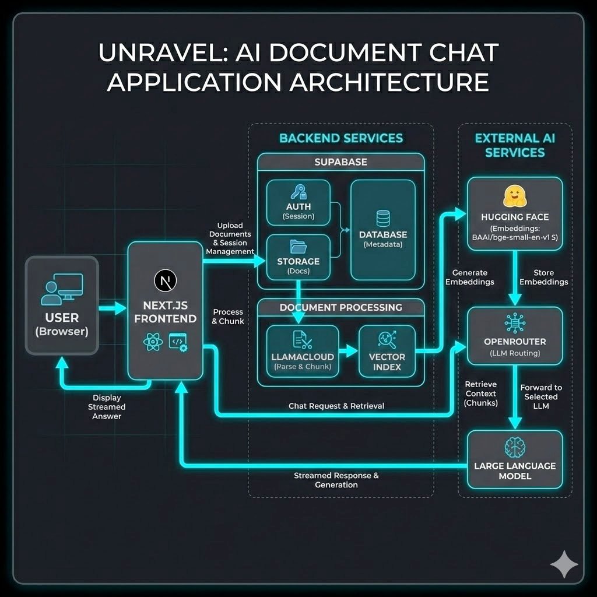

# Unravel - AI Document Chat Application

Unravel is a modern, AI-powered document chat application that allows users to upload documents and interact with them using a Retrieval-Augmented Generation (RAG) pipeline.



## 🚀 Features

- **Document Ingestion**: Upload PDF, DOCX, and other formats.
- **RAG Pipeline**: Powered by **LlamaIndex** and **LlamaCloud** for accurate parsing, chunking, and retrieval.
- **Vector Search**: Uses **Hugging Face** embeddings (`BAAI/bge-small-en-v1.5`) for semantic search.
- **Smart Chat**: Streaming chat interface powered by **Google Gemini 2.0 Flash** (via OpenRouter).
- **Secure**: Full authentication and row-level security with **Supabase**.

## 🛠️ Tech Stack

- **Frontend**: Next.js 16 (App Router), React 19, Tailwind CSS v4
- **Backend**: Next.js API Routes
- **Database**: Supabase (PostgreSQL)
- **Auth**: Supabase Auth
- **Storage**: Supabase Storage
- **AI/ML**: 
  - LlamaIndex (Framework)
  - LlamaCloud (Parsing & Indexing)
  - OpenRouter (LLM Provider)

## 🏗️ Architecture

1.  **Ingestion**: Files are uploaded to Supabase Storage, then processed by LlamaCloud where they are parsed, chunked, and embedded into a Vector Index.
2.  **Retrieval**: User queries are embedded and matched against the Vector Index to find relevant context.
3.  **Generation**: The LLM receives the user query + retrieved context to generate an accurate, grounded response.

## 🚦 Getting Started

1.  **Clone the repository**
2.  **Install dependencies**: `npm install`
3.  **Set up Environment Variables**:
    ```bash
    NEXT_PUBLIC_SUPABASE_URL=...
    NEXT_PUBLIC_SUPABASE_ANON_KEY=...
    LLAMA_CLOUD_API_KEY=...
    OPENROUTER_API_KEY=...
    HUGGINGFACE_API_KEY=...
    ```
4.  **Run Development Server**: `npm run dev`
